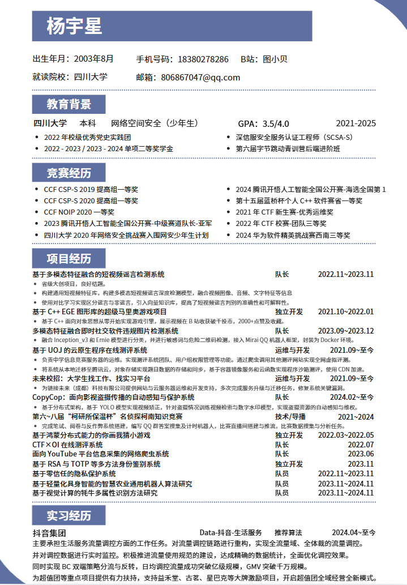

### 算法岗简历参考

#### 1. 简历模版

> 以下提供一个适合算法岗求职的简历模版，内容涵盖算法岗面试官最关注的部分。你可以根据自己的实际情况进行修改。

**已有简历参考：**

**简历结构建议（一页纸为佳）：**

| 模块 | 内容说明 |
| :--- | :--- |
| 基本信息 | 姓名、电话、邮箱、GitHub/博客链接（如有） |
| 教育背景 | 学校、专业、学历、毕业时间、GPA（高的话写上） |
| 专业技能 | 按类别列出：编程语言（Python/C++）、框架（PyTorch/TensorFlow）、工具（Git/Docker）等 |
| 项目经历 | 2-3个项目，按 STAR 法则描述（情境-任务-行动-结果） |
| 实习经历 | 有则写，重点描述在实习中负责的算法相关工作 |
| 论文/竞赛 | 有论文发表或竞赛获奖（如Kaggle、天池等）一定要写上 |
| 荣誉奖项 | 国家奖学金、ACM/数学建模等竞赛奖项 |

**简历模版参考：**
- [Overleaf LaTeX 简历模版](https://www.overleaf.com/latex/templates/bill-ryans-elegant-latex-resume/xcqmhktmzmsw)
- [GitHub 开源简历模版集合](https://github.com/topics/resume-template)

**算法岗简历注意事项：**
- 项目经历是核心，尽量用**量化数据**来体现成果（如"准确率提升5%"、"推理速度提升2倍"等）
- 写上你熟悉的模型和算法名称，但不要堆砌关键词，面试官会深挖
- 如果有论文或竞赛经历，放在醒目位置
- GitHub 上有算法相关项目的话，附上链接

---

#### 2. 简历常见问题

**[1] 本科期间没有参加过像样的项目，简历中该怎么写项目经历？**

不用担心，很多本科生都面临这个问题。以下是一些实用的建议：

- **课程大作业也是项目**：比如机器学习课上的分类实验、数据结构课上的算法实现、深度学习课上的图像分类等，只要做得认真、有完整流程，都可以作为项目经历写入简历。
- **复现经典论文**：选择一篇经典的论文（如 ResNet、BERT、YOLO 等），自己动手复现，理解原理并跑通实验。这既锻炼了能力，也是很好的项目经历。
- **参加Kaggle/天池等数据竞赛**：即使没有拿到好名次，参赛过程本身也是项目经历。重点描述你的分析思路、特征工程、模型选择和调参过程。
- **做一个小而完整的项目**：比如基于公开数据集做一个文本情感分析、图像目标检测、推荐系统等。关键是要有**完整流程**：数据预处理 → 模型选择 → 训练 → 评估 → 优化。
- **开源贡献**：给一些知名的开源项目提 PR 或 Issue，哪怕是小修改，也能体现你的参与度。

**[2] 简历如何突出项目经验、核心技能和成果？**

推荐使用 **STAR 法则** 来描述项目经历：

| 要素 | 含义 | 示例 |
| :--- | :--- | :--- |
| **S**（Situation） | 项目背景 | "在XX课程/竞赛中，需要解决XX问题" |
| **T**（Task） | 你的任务 | "负责数据预处理和模型训练" |
| **A**（Action） | 你的行动 | "使用PyTorch实现XX模型，采用XX方法进行数据增强，通过XX策略进行超参调优" |
| **R**（Result） | 你的成果 | "模型准确率达到XX%，相比基线提升XX%，排名前XX%" |

**其他技巧：**
- 核心技能用**分类列表**展示，不要写成一段话
- 成果尽量**量化**，用数字说话
- 突出你**独立完成**的部分，而不是团队中别人做的
- 技术名词写准确，不要写"精通"（除非真的精通），用"熟悉"、"了解"更合适
